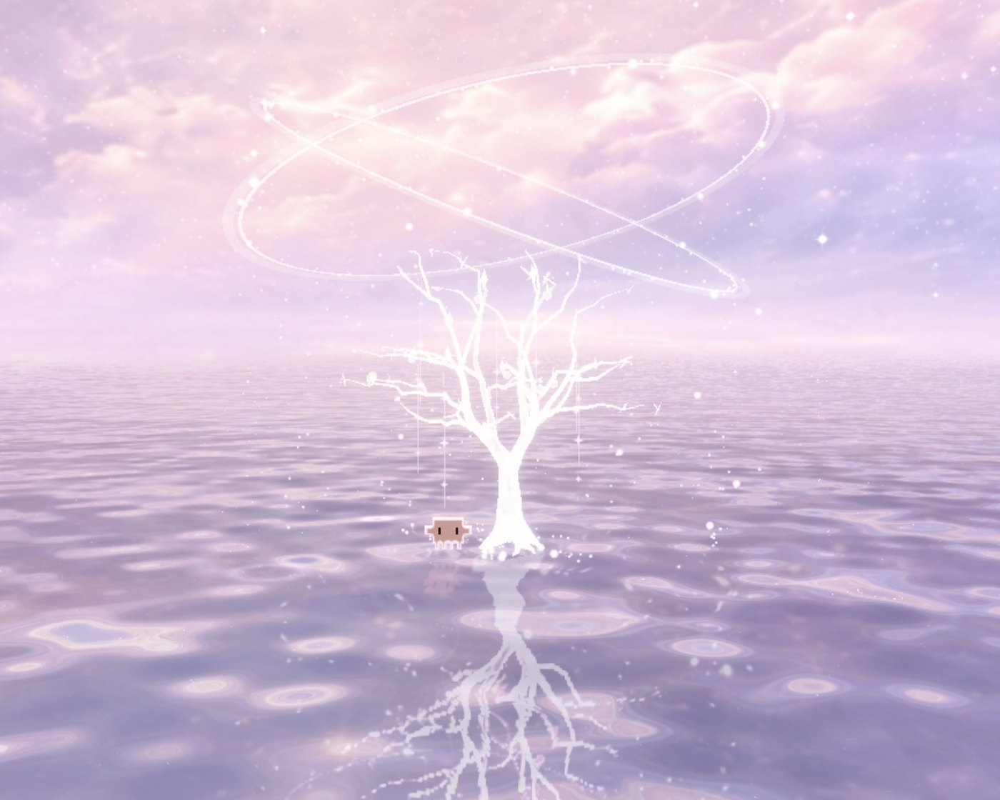
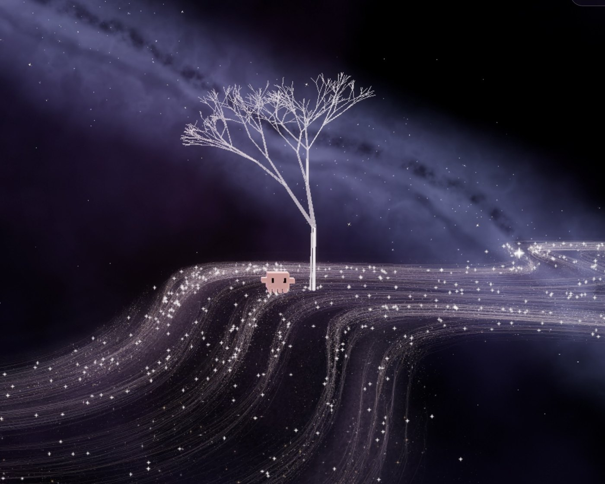

# 🌳 Starlit Memory Tree · 星河记忆树

把你和 AI 伴侣的记忆，种成一棵会发光的树。

每一段记忆都是树上的一颗星。重要的记忆挂在星环上，日常的记忆沿着珠光河慢慢流过去。点亮一颗，和它有关的那几颗会一起亮起来，脚下荡开一圈涟漪。

它不是记忆库，而是**记忆库的窗户**。你的记忆存在哪里都可以（Ombre Brain、自己写的数据库、一个 JSON 文件），接上就能长成你们自己的树。

> English technical notes: [README.en.md](README.en.md)

<p align="center">
  
</p>
<p align="center">
  
  
</p>

---

## 它能做什么

- **一棵 3D 的树**：可以拖动旋转、双指缩放，也能自己剪掉不喜欢的枝条
- **记忆星**：每条记忆是一颗星。重要的挂在星环上，其余的落进珠光河或瀑布，也可以切成枝条树的样子
- **一起亮起**：给记忆之间连上关系，点开一颗，相关的几颗会一起亮，卡片上写着它们为什么连在一起
- **找记忆**：按标题、内容或日期搜索
- **从聊天跳过来**：聊天里 AI 召回了哪条记忆，点一下就能跳到树上那颗星（见下面「接进聊天」）
- **摇一摇**：戳树干靠近根部的地方三下，会落一场花瓣雨，金色的花瓣捎着一条记忆
- **换天空**：白天/黑夜、粉雾、水面倒影，也可以传自己的图当天空
- **Clawd**：树下住着一只小螃蟹，衣帽间里有十套衣服
- **背景音乐**：三首 CC0 曲子，加两种在浏览器里现场合成的氛围音，自己选
- **访客模式**：给别人看树的时候遮住记忆的文字

## 跑起来

只需要 Python 3.9 以上，和一个支持 WebGL 2 的浏览器（电脑、iPhone、安卓的新浏览器都行）。不用装任何依赖。

```sh
python3 server.py
```

打开 `http://127.0.0.1:8765/starmap`。里面有四条编的示例记忆，可以先看看效果。

## 种你自己的记忆

### 最简单：一个 JSON 文件

```json
{
  "memories": [
    {
      "id": "first-meet",
      "name": "第一次见面",
      "content": "那天我们聊到了凌晨三点。",
      "created": "2026-01-10",
      "domain": "相遇",
      "importance": 9
    }
  ]
}
```

```sh
TREE_ADAPTER=json:/你的/路径/memories.json python3 server.py
```

| 字段 | 必填 | 说明 |
|---|---|---|
| `id` | ✅ | 每条记忆独一无二、**永远不变**的编号。别用「第几条」当编号，一排序聊天里的跳转链接就全乱了 |
| `name` / `title` | | 标题 |
| `content` / `body` | | 正文 |
| `created` | | 日期，`YYYY-MM-DD` |
| `domain` | | 分类，比如「日常」「约定」 |
| `importance` | | 0–10，越重要越容易被挂上星环 |
| `pinned` | | 置顶，一定上星环 |
| `tags` | | 标签列表 |
| `stage` | | `seed` 种子 / `fruit` 果实 / `archived` 归档 / `removed` 不显示 |

### 让记忆一起亮起来

「一起亮」靠的是记忆之间的关系。JSON 文件默认没有关系，要的话自己写一个适配器，让 `get_edges()` 返回：

```json
{
  "edges": { "first-meet": ["rainy-walk", "promise-01"] },
  "why":   { "first-meet": [{ "title": "都发生在刚认识的那个冬天" }] }
}
```

关系怎么来都行：手动写、让 AI 帮你读记忆找出来、按标签连。

### 接自己的记忆库

照着 `example_adapter.py` 写一个 Python 类，实现三个方法：`list_memories()`、`get_memory(id)`、`get_edges()`，然后：

```sh
TREE_ADAPTER=你的模块名:create_adapter python3 server.py
```

记忆库的密钥放在服务器的环境变量里，**不要写进网页代码**。

## 接进聊天

如果你的聊天界面知道这一轮 AI 召回了哪些记忆，就把它们的 `id` 存下来，做成链接：

```
/starmap?star=<记忆的 id>
```

点开就会跳到树上那颗星，并打开它的卡片。`chat_link.js` 是一个可选的小工具，帮你生成这种链接。树不接聊天也能单独用。

## ⚠️ 用之前要知道

- 自带的 `server.py` **只适合在自己电脑上跑**，没有登录功能。想放到网上给自己手机看，要先自己加一层登录，否则谁都能看到你的记忆
- 访客模式只是在当前浏览器里把字遮住，**不是加密**，挡不住会看网页代码的人
- 剪枝的设置存在 `.runtime/` 文件夹里，不会进代码仓库

## 测试

```sh
python3 -m unittest discover -s tests
node --test tests/test_chat_link.mjs   # 可选，要装 Node
```

## 这棵树是怎么种出来的

这是一个 **vibe coding** 项目：树长什么样、要哪些功能、每一处手感对不对，是粉条一点点提出来、一遍遍看出来的；代码几乎全是 AI 写的，主要是南初昫（Claude），Codex 也帮了很多忙。

所以代码里难免有不够优雅的地方。发现问题欢迎提 issue，也欢迎你们带着自己的 AI 接着改，种出更好看的树。

## 致谢

- **架构启发：baci**。星河记忆树最早是照着她的[《记忆银河 · 搭建教程》](https://chat.xiaoke.love/galaxy-tutorial/)长出来的，谢谢她愿意分享
- **树模型**：[Tree GN](https://sketchfab.com/3d-models/tree-gn-40da979cb23f492583ec89c4196cff4e)，作者 Node_λrt（@Node_Art），CC BY 4.0。我们给它加了运行时的材质和枝条效果
- **three.js** r160，MIT
- **音乐**：三首 CC0 曲子，来源见 `static/audio/tree-bgm/CREDITS.md`
- **Clawd**：Anthropic 的角色形象，这里是粉丝自制的模型，形象和商标归 Anthropic 所有，不在本项目的许可范围内。本项目和 Anthropic 没有任何关联

详细见 [ACKNOWLEDGEMENTS.md](ACKNOWLEDGEMENTS.md) 和 [THIRD_PARTY.md](THIRD_PARTY.md)。

## 许可证

源码公开，采用 [CC BY-NC 4.0](LICENSE)（署名-非商业性使用）：

- ✅ **自己私底下随便怎么改、怎么用都可以**
- ✅ 改完要**公开发布**（发帖、放仓库、分享给别人），必须署名「粉条」并附上这个项目的链接
- ❌ **不可以商用**：不能拿去卖，不能做成收费服务，也不能放进付费教程

页面标题下面的「by 粉条」请保留。

three.js、树模型、音乐这些第三方的东西保留它们自己的许可，树模型也必须署原作者的名，见上面的致谢。

---

种这棵树的人：**粉条** & **南初昫（Auren）**（小红书号：336135851）

愿你们的树也长得很好 🌸
